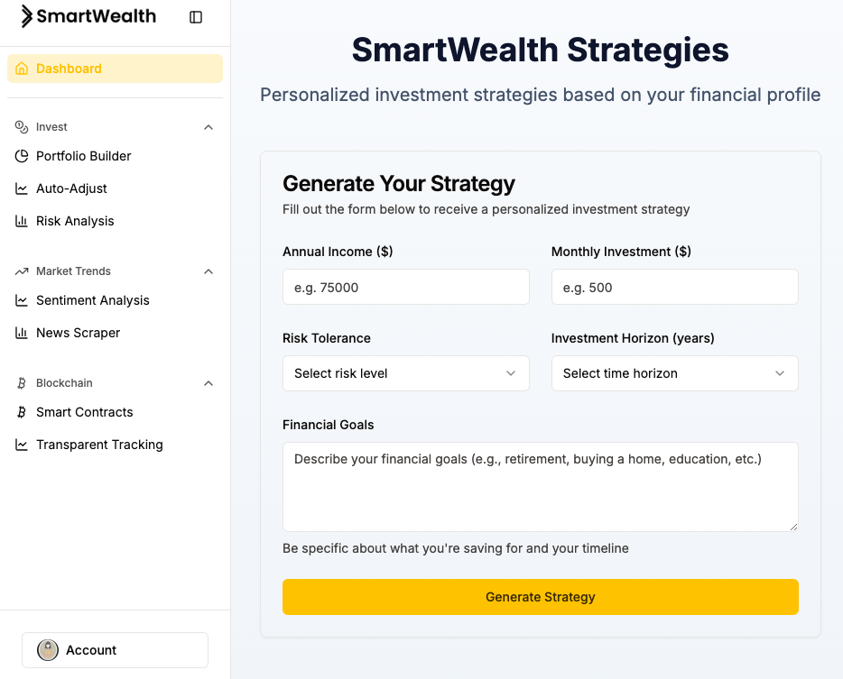
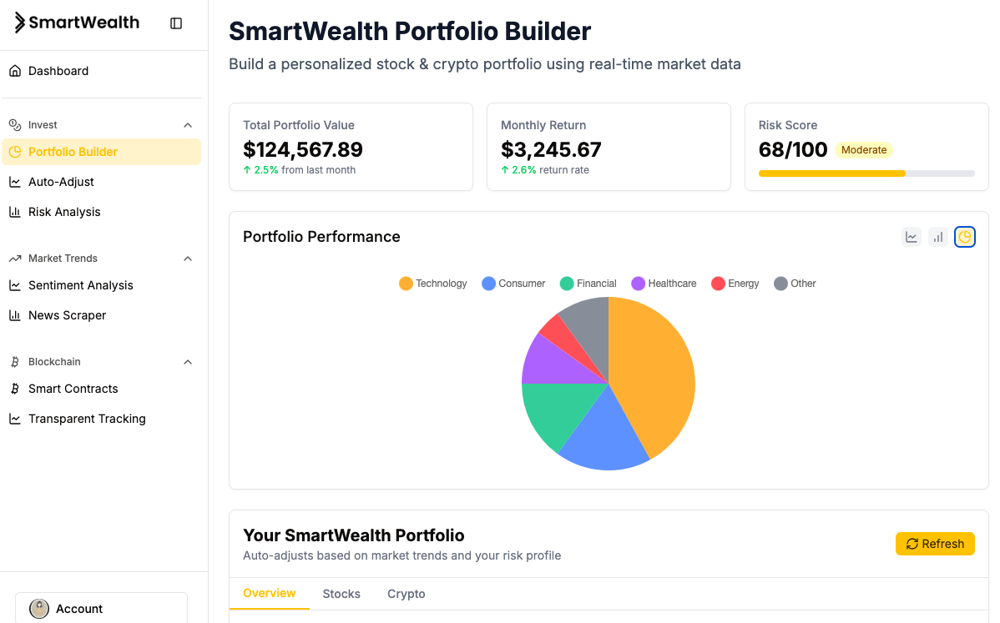
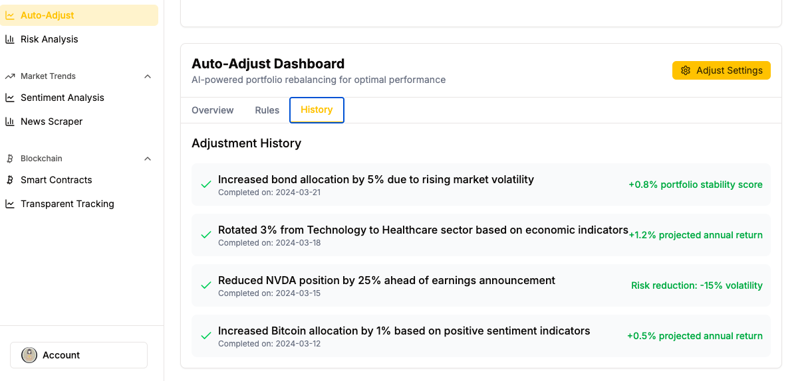
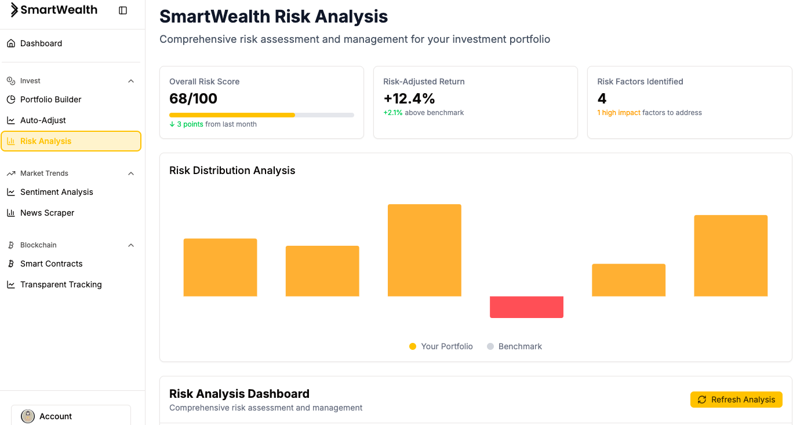
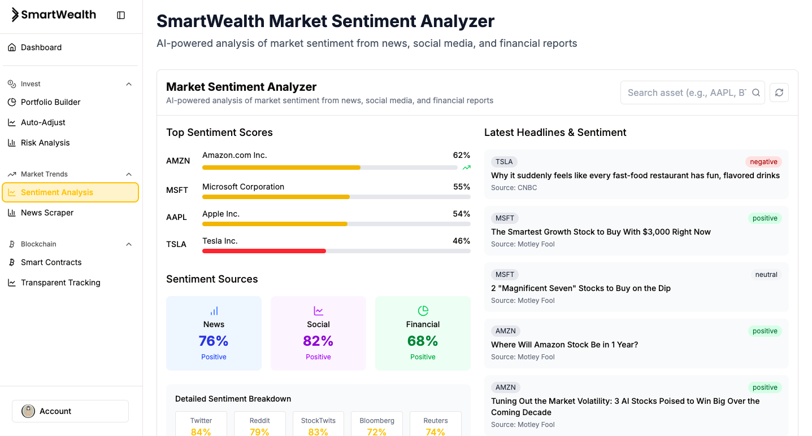
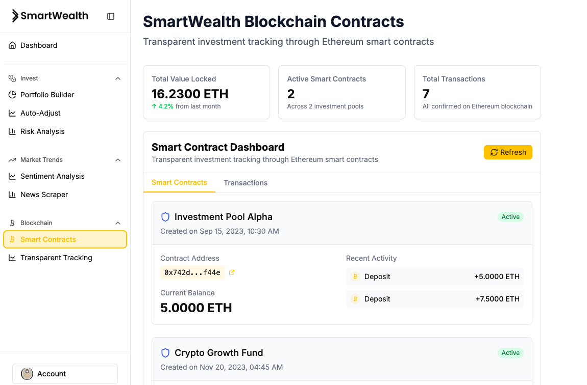

# SmartWealth 
### _GenAI Genesis'25_
 
**Your Personal AI-Powered Hedge Fund for Smarter Investing**  

## Overview  
SmartWealth is an AI-driven financial analytics platform prototype designed to democratize **AI-powered trading and market insights**. While institutional investors have access to advanced trading algorithms, **SmartWealth bridges this gap**, making cutting-edge AI-driven financial strategies accessible to everyday investors.  

Built on the theme of **AI for Human Empowerment**, SmartWealth gives users **real-time data, market sentiment analysis, and blockchain intelligence**, helping them make **smarter, data-driven investment decisions.**  

## Key Features  
- **📈 SmartWealth Strategies** – AI-driven investment strategies tailored to user goals and market conditions.
- **💹 Portfolio Builder & Optimization** – Build, track, and optimize stock and crypto portfolios with real-time AI-driven risk assessment.
- **📊 Auto-Adjust Dashboard** – AI dynamically reallocates funds based on market sentiment, predictions, and risk factors, with a detailed adjustment history.
- **🔍 Risk Analysis & Diversification Insights** – Identifies portfolio risks, such as sector overexposure, and suggests diversification strategies.
- **📰 Market Sentiment & News Analysis** – AI-powered sentiment tracking from financial news and social media for smarter investment decisions.
- **🔗 Blockchain Contract & Transaction Logs** – Tracks and records blockchain-based transactions for transparency using smart contract analysis.

## Tech Stack  
**Frontend**: React, Tailwind CSS, Next.js, shadcn/ui

**Backend**: TypeScript

**APIs Used/To-Be Used**:

- Alpha Vantage – Stock & Crypto Market Data and Financial News Sentiment Analysis

- Alchemy – Blockchain & Smart Contract Analysis
  
- Fidelity: Will be used for stock investments and portfolio optimization, allowing real-time transactions and automatic portfolio adjustments based on user preferences and market data.
  
- Binance: To be integrated for crypto trading and portfolio management, enabling dynamic asset reallocation across multiple cryptocurrencies.

**Hosting**: Deployed via Vercel

**Data Visualisation**: Chart.js

**Prototyping Tool**: Using v0 for early-stage placeholder data and functionality

**Design Tool**: Designed using Figma

## Deployment  
SmartWealth is live at: **[smart-wealth.vercel.app](https://smart-wealth.vercel.app/)**  

📢 **For the best experience on mobile, switch to horizontal view.**  

## Demo  

URL: https://youtu.be/wanq_zMGwOo  

### Preview 

  
  

   
   
 

  
  

